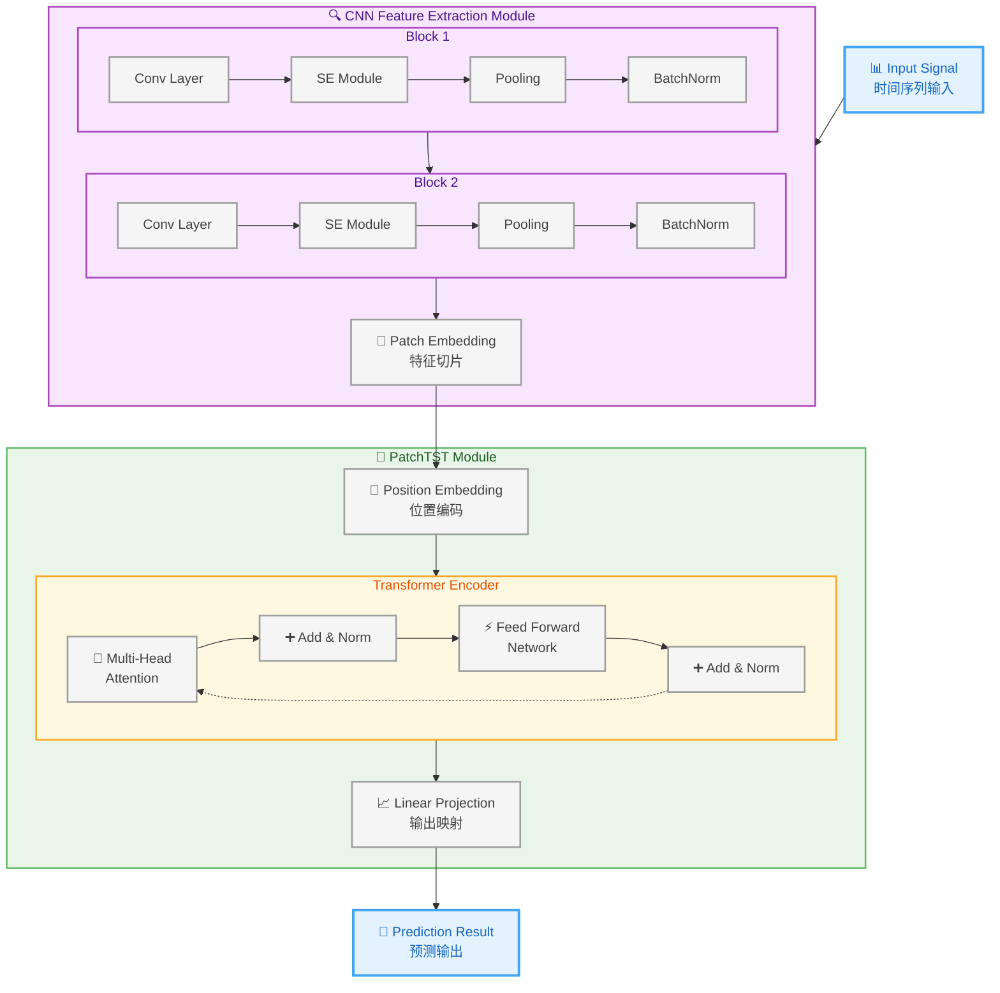

```mermaid
graph TB
    Input[📊 Input Signal<br/>时间序列输入]
    
    subgraph CNN_Module ["🔍 CNN Feature Extraction Module"]
        direction TB
        
        subgraph Block1 ["Block 1"]
            Conv1[Conv Layer] --> SE1[SE Module]
            SE1 --> Pool1[Pooling]
            Pool1 --> BN1[BatchNorm]
        end
        
        subgraph Block2 ["Block 2"]
            Conv2[Conv Layer] --> SE2[SE Module]
            SE2 --> Pool2[Pooling]
            Pool2 --> BN2[BatchNorm]
        end
        
        Block1 --> Block2
        Block2 --> PatchEmb[🧩 Patch Embedding<br/>特征切片]
    end
    
    subgraph TST_Module ["🤖 PatchTST Module"]
        direction TB
        PosEmb[📍 Position Embedding<br/>位置编码]
        
        subgraph Transformer ["Transformer Encoder"]
            direction LR
            MHA[🎯 Multi-Head<br/>Attention] 
            AddNorm1[➕ Add & Norm]
            FF[⚡ Feed Forward<br/>Network]
            AddNorm2[➕ Add & Norm]
            
            MHA --> AddNorm1
            AddNorm1 --> FF
            FF --> AddNorm2
            AddNorm2 -.-> MHA
        end
        
        PosEmb --> Transformer
        Transformer --> LinearProj[📈 Linear Projection<br/>输出映射]
    end
    
    Output[🎯 Prediction Result<br/>预测输出]
    
    Input --> CNN_Module
    PatchEmb --> PosEmb
    LinearProj --> Output
    
    classDef inputOutput fill:#e3f2fd,stroke:#42a5f5,stroke-width:3px,color:#1565c0
    classDef cnnModule fill:#f8e6ff,stroke:#ab47bc,stroke-width:2px,color:#4a148c
    classDef tstModule fill:#e8f5e8,stroke:#66bb6a,stroke-width:2px,color:#1b5e20
    classDef transformer fill:#fff8e1,stroke:#ffa726,stroke-width:2px,color:#e65100
    classDef defaultNode fill:#f5f5f5,stroke:#9e9e9e,stroke-width:2px,color:#424242
    
    class Input,Output inputOutput
    class CNN_Module,Block1,Block2 cnnModule
    class TST_Module tstModule
    class Transformer transformer
    class Conv1,SE1,Pool1,BN1,Conv2,SE2,Pool2,BN2,PatchEmb,PosEmb,MHA,AddNorm1,FF,AddNorm2,LinearProj defaultNode
```